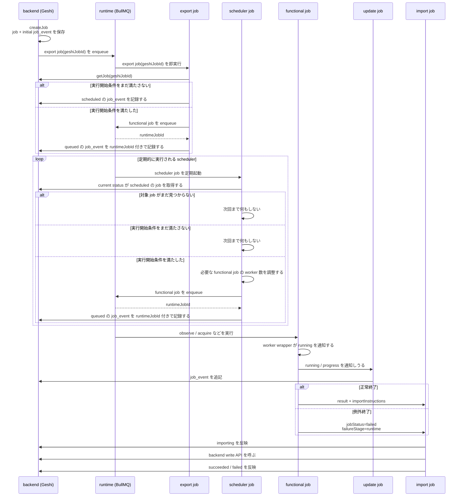

# 0038 job bridge worker bootstrap

## 位置づけ

この文書は，`ADR-0038` の検討メモ置き場である．

## 決めること

- `createJob` と `export job` の関係
- `export job` の責務
- `update job` の責務
- `import job` の責務
- bridge worker と backend API / store の境界
- BullMQ 側の job data / result の shape
- 冪等性と再試行の扱い

## プレイヤー

- backend (Geshi)
- runtime (BullMQ)
- bridge jobs
  - `export job`
  - `scheduler job`
  - `update job`
  - `import job`
- functional jobs
  - `observeChannel`
  - `acquireEntry`
  - etc.

## タイムライン



## 決まったこと

- backend が `createJob` を行う時は，まず DB に `job` と初期 `job_event` を書き込む
- `createJob` の時点で `export job(geshiJobId)` を enqueue する
- `export job` の input は `geshiJobId` のみとする
- `export job` は backend から `getJob(geshiJobId)` を読んで判断する
- `export job` は
  - 実行開始条件をまだ満たさない job について `scheduled` の `job_event` を記録する
  - 実行開始条件を満たした job について runtime queue へ functional job を enqueue し，`queued` の `job_event` を `runtimeJobId` 付きで記録する
- `scheduler job` は定期起動される
- `scheduler job` は current status が `scheduled` の Geshi 側 `job` を対象にする
- `scheduler job` は，実行開始条件を満たした `scheduled` job について
  - 必要な worker 数を調整する
  - runtime queue へ functional job を enqueue し，`queued` の `job_event` を `runtimeJobId` 付きで記録する
- functional job の runtime queue へ渡す raw data は，少なくとも次の形とする

```ts
{
  context: {
    jobId: string,
  },
  payload: unknown,
}
```

- `update job` は，受け取った bridge 入力をそのまま `job_event` に追記する責務に留める
- `update job` は BullMQ 固有 event には寄せず，functional job の worker wrapper から明示的に呼ぶ
- worker wrapper は
  - 実行開始時に `update job` へ `running` を渡す
  - 正常終了時に `import job` へ `result + importInstructions` を渡す
  - 例外終了時に `import job` へ `jobStatus = failed` と `failureStage = runtime` を渡す
- bridge worker から使う backend API は
  - `createJob`
  - `appendJobEvent`
  - `getJob`
  - `listJobs`
  を前提にする
- `import job` は
  - まず `importing` を積む
  - その後 `importInstructions` を順に処理する
  - すべて成功したら `result.jobStatus` を積む
  - 途中で失敗したら `failureStage = "import"` の `failed` を積んで再 throw する

## 決まっていないこと

- `scheduler job` の定期起動を，BullMQ 上でどう実現するか
- `export job` が読む backend API の shape
- `update job` が `job_event` に何を記録するか
- `import job` と backend write API の transaction 境界
- bridge worker の重複実行や retry をどう冪等に扱うか
