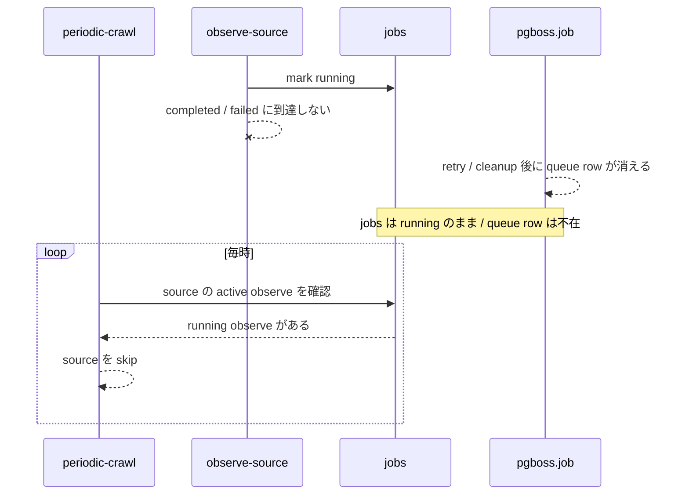
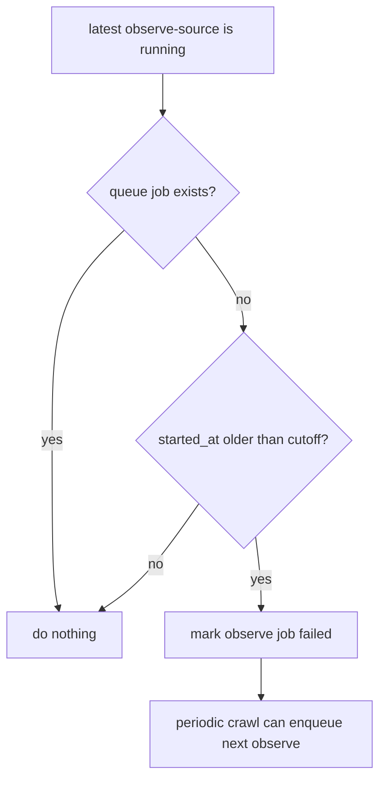

# Design Log 0072

`stanica` の crawl が途中で死んだことをどう検知し，どう復旧するかに絞って再設計する。

このログでは queue-backed job 全般の整合回復は扱わない。

## 固定する観測事実

対象 source:

- URL: `https://shonenjumpplus.com/rss/series/17107419589695933516`
- source id: `00218916-6ea9-4b55-8e78-a1def7654d7a`
- source slug: `satanica-1132f3a18898`
- periodic crawl: enabled
- crawl interval: 60 minutes

観測された stale job:

- `observe-source`
- job id: `019e173b-cc31-7577-9ea3-87b55bec80ed`
- status: `running`
- attempt_count: `3`
- started_at: `2026-05-11 13:31:28 UTC`
- 対応する `queue_job_id` は `pgboss.job` に存在しない
- completed / failed の log はない

結果:

- periodic crawl job 自体は毎時成功し続けた
- しかしこの source は active observe が残っていると解釈され，再投入されなかった



## 1. 途中で死んだことを検知する方法

検知したいのは「job 一般が古い」ことではなく，「periodic crawl 対象 source の最新 observe が途中状態に閉じ込められ，source の再投入を止めている」ことである。

### 検知対象

まず対象を次に限定する。

- periodic crawl が有効な source
- その source の `observe-source` job
- source ごとの最新 observe job

`acquire-content` は今回の直接対象にしない。acquire が stale でも，今回観測したように observe 自体は進む場合があるため，source crawl 停止の検知条件に混ぜると対象が広がりすぎる。

### 検知条件

source は，次をすべて満たすとき「crawl が途中で死んでいる疑いあり」とする。

- 最新 `observe-source` job が `running`
- `queue_job_id` が `null` ではない
- 対応する queue job が `pgboss.job` 上の `created` / `retry` / `active` に存在しない
- 最新 observe job より新しい `succeeded` / `failed` の `observe-source` job がない
- `started_at` が `max(24h, crawl_interval * 3)` より古い

猶予時間は `max(24h, crawl_interval * 3)` とする。

理由:

- `observe-source` は通常 30 秒 timeout の plugin 呼び出しを中心に構成されており，24h を超える正常実行は現時点では想定しない
- source ごとの crawl interval が長い場合にも，少なくとも 3 回分の実行機会を待ってから stale とみなせる
- stanica の事象では 2026-05-11 13:31 UTC から 2026-06-10 まで残っていたため，この猶予で確実に検知できる

### 検知に使わないもの

- `planned`
  - 未投入予約や削除済み対象など正常な未投入状態を含むため，途中停止の根拠にしない
- `queued`
  - worker takeover 前なので，「途中で死んだ observe」とは断定しない
- heartbeat
  - 今回は導入しない
  - worker timer による生存証跡はこの ADR の範囲外とする

### 検知クエリの概形

実装時は，source ごとに最新 observe job を取り，次のような条件を見る。

```sql
jobs.kind = 'observe-source'
and jobs.status = 'running'
and jobs.queue_job_id is not null
and jobs.started_at < :cutoff
and not exists (
  select 1
  from pgboss.job queue_job
  where queue_job.id = jobs.queue_job_id
    and queue_job.state in ('created', 'retry', 'active')
)
```

この条件は「自動 failed 化してよい」ではなく，まず「source crawl 停止を検知する」ための条件である。

実装では，この条件を満たした job について source id, job id, queue job id, started_at を返す。
source id は `jobs.payload -> 'source' ->> 'id'` から読む。

## 2. リカバリする方法

リカバリの目的は，source を次回以降の observe 投入対象に戻すことである。

### 回収対象

回収するのは，検知条件を満たした source の最新 `observe-source` job に限定する。

`queued` job や `planned` job は回収しない。`acquire-content` は source crawl 停止の解除に必要な場合だけ別途扱う。

### 回収処理

回収時は対象 job を `failed` にし，`retryable=false` にする。

`retryable=false` にする理由は，これは worker が返した業務上の失敗ではなく，stale な途中状態を終端へ寄せる運用上の cleanup だからである。再実行は同じ job の retry ではなく，次回 scheduler が新しい `observe-source` job を作ることで行う。

保存する failure message は，worker 内部の実装条件ではなく，運用上の事実を残す。

候補:

```text
Source crawl was recovered because the latest observe job remained running after its queue job disappeared.
```

metadata に cleanup 情報を残す。

- cleanup reason: `stale-observe-source-job`
- cleanedUpAt
- queueJobId
- sourceId
- detectedBy

### 再投入

回収後の再投入は 2 案ある。

案 A: 回収だけ行い，次回 periodic crawl に任せる

- 実装が単純
- recovery と enqueue の責務が分かれる
- 回復まで最大 1 interval 待つ

案 B: 回収後すぐ `observe-source` を enqueue する

- 回復が早い
- recovery 処理が enqueue まで持つ
- 失敗時の扱いが複雑になる

初期実装は案 A を採る。

stanica のような長期停止では即時性よりも，古い `running` を確実に終状態へ戻すことが重要である。また recovery 処理が enqueue まで持つと，回収成功後に enqueue だけ失敗した場合の扱いが増える。

### 実行主体

初期実装では，`stale source crawl reconciliation` を service / repository operation として切り出し，source crawl scheduler は source 選定前にそれを呼ぶ。

handler 内に判定 SQL を直接埋めない。scheduler が持つ責務は「source 選定前に reconciliation を実行する」ことであり，stale 判定の詳細は repository 側に閉じる。

### リカバリ後の状態



## 実装時に固定するインターフェース案

reconciliation は，検知と回収を 1 operation として扱う。

返り値は集計 object ではなく，回収した geshi job id の配列を含む情報にする。

```ts
type RecoveredInfo = {
  failedJobIds: string[];
};
```

候補 API:

```ts
recoverStaleObserveSourceJobs(input: {
  detectedBy: string;
  now: Date;
}): Promise<Result<RecoveredInfo, JobRepositoryError>>;
```

`now` はテスト容易性のため呼び出し側から渡す。

## queue job の存在判定

実行継続の判定には `pgboss.job` の `created` / `retry` / `active` だけを見る。

archive / completed table がある場合でも，それは「過去に何が起きたか」の診断には使えるが，「今この job が実行継続中か」の blocking 判定には使わない。
