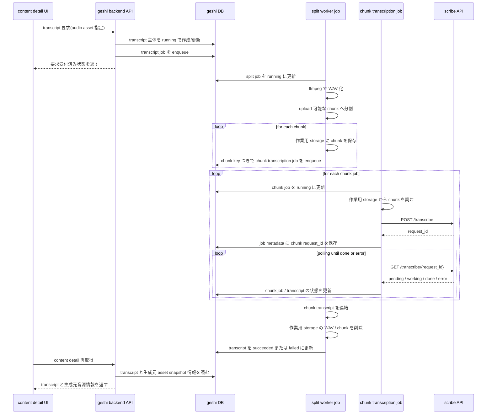

# Design Log xxxx

`scribe` 連携タスクの開始時点メモ．

## この段階の狙い

- `scribe` 連携をどの責務境界へ置くかを先に整理する
- 実装前に設定，secret，失敗モードの論点を固定する
- `scribe` 固有仕様を内部契約へ漏らさない方針を確認する
- 論点を `接続`, `データ保持`, `job orchestration` の 3 ADR に分ける

## 現時点の前提

- `scribe` 本体は `github.com/t-ashula/scribe` にある Python 3.12+ / FastAPI 実装である
- `scribe` API は `POST /transcribe` と `GET /transcribe/{request_id}`，`POST /summarize` と `GET /summarize/{request_id}` を持つ
- `transcribe` は `audio/x-wav` upload を受け，Redis / RQ で非同期 job を処理し，結果は 24 時間 TTL で保持される
- `geshi` には `backend`, worker, CLI, source collector plugin という複数の呼び出し主体がある
- `scribe` 接続設定は，source ごとではなくアプリケーション全体の運用設定として扱う前提で考える
- v0.3.0 開発時の `/packages/scribe-client` に TypeScript client の残骸がある
- transcript 要求は `content` 画面から audio asset に対して起こす
- summarize も最終的には扱いたいが，初手は transcript を先に扱う

## client 残骸の観察

- `v0.3.0/packages/scribe-client` は `transcribe`, `getTranscription`, `summarize`, `getSummary` を持つ
- upload の multipart 組み立てや polling 処理は参考になる
- `getTranscription(..., false)` と `getSummary(..., false)` は `done` 以外を例外にしており，`pending` / `working` / `error` を値として扱えない
- 現行 `geshi` へ持ち込むなら，reference implementation として読み，API 差分と状態表現を見直したうえで再設計する方が安全である

## この段階で決めたいこと

- 最初の `scribe` 呼び出し主体をどこに置くか
- `scribe` の polling 型 job を `geshi` 側のどの job / state に対応づけるか
- `scribe` が返す情報のうち，`geshi` 内部で正本として保持するものは何か
- timeout, retry, circuit breaker 相当の失敗制御をどこで担うか
- 可観測性として何を log / metric に残すか
- test でどこまで fake / stub 化するか

## いま分かっている方針

- スコープは最終的に transcription と summarization の両方だが，実装順は transcription を先にする
- summarize は transcript を前提とするため，transcript の要求導線，保持先，状態管理を先に固める
- transcript 要求は UI から audio asset に対して明示的に発行する
- transcript 要求の対象は，`content` に属する audio asset 全てとする
- 同一 audio asset に対して，要求発行後に成功または失敗へ至るまでは追加要求を許可しない
- transcript のための重い処理は job で扱う
  - `ffmpeg` による音声の WAV 化
  - upload 可能な単位への分割
  - `scribe` への request / polling
- WAV 化した音声と chunk 音声は，`asset` 永続保存とは別の作業用 `storage` へ置き，終了時に削除する
- 当面の作業用 `storage` 実装は local filesystem でよいが，job 間で `/tmp/foo/chunk1.wav` のような host 固有 path を直接やり取りする前提にはしない
- job は少なくとも 2 段に分ける
  - 分割だけを行う job
  - 個別 chunk を `scribe` に送る job
- `scribe request_id` は transcript 本体ではなく，`metadata jsonb` を持てるよう拡張した job 側に永続化したい
- `transcriptId` は job payload 側で持ち，chunk job の metadata は `scribeRequestId` だけに絞る方がよい
- split job は chunk 音声を作業用 `storage` に書き，chunk job は payload 内の作業用 key を使って読み出す形にしておくと，将来 worker が同一 filesystem を共有しない配置にも寄せやすい
- 1 時間 podcast を単一 WAV upload すると数百 MB 級になり現実的でないので，`geshi` 側で chunk に分割して複数 request を束ねる必要がある
- transcript 結果は派生 asset よりも，`content` に直接ひもづく `transcript` 主体として扱う方がきれいそうである
- その場合でも，どの audio `asset snapshot` から生成されたかは追えるようにしたい
- また，worker から任意の場所へ自由に返せるわけではないので，transcript 主体自体が「実行中」と「終了済み」を持つ必要がある
- さらに chunk job 前提だと，transcript 側も部分結果を保持したうえで最終結合へ進める構造が必要になる
- retry とは別に，同じ audio に対して再度の文字起こしを明示的に走らせる余地も残したい
- そのため transcript 側には，最初から「何度目の文字起こしか」を識別する軸を持たせた方がよい
- 特に `content` に複数 audio asset や版違いがある場合，どの音源に対する transcript かを UI で見失わないようにする必要がある
- そのためには，DB 上で由来を持つだけでなく，API 応答にも snapshot 由来の音源識別情報を載せる必要がある
- transcript 導線の UI は独立画面へ分けず，`content detail` の中に収める
- 長期的には `content` 画面から自然に扱える形に寄せ，利用者が `asset` を強く意識しない方向を維持したい
- 開発時の `scribe` 起動は，git submodule よりも sibling checkout を `compose` / `Makefile` から起動する方が軽い
- そのため `scribe` 本体は別 repository のままにし，`geshi` 側には開発用の起動入口だけを持つ方針に寄せる

## 異常系メモ

- chunk transcription job が worker crash で再実行されても，job metadata の `request_id` を使って polling 再開できるようにしたい
- `scribe` が終わらない場合に備えて，chunk 単位の timeout が必要
- 親 job はメモリ上の進行状況ではなく，DB に保存された chunk 状態を読み直して再集約できる必要がある
- 初期段階では partial success をやらず，1 chunk でも失敗または timeout したら transcript 全体を `failed` とするのが素直
- ただし利用者に chunk ごとの選択 UI は要求したくない
- UI 上は再試行ボタンを 1 つだけ出し，内部で失敗 chunk 分の job だけを出す方がよい
- その再試行では，対象 chunk の古い `request_id` を捨てて新しい `scribe` request を切り直す方がよい
- 再試行時に中間生成物を再利用すると状態管理が複雑になるので，無駄は多くても毎回変換と分割をやり直す方が素直
- `asset` 用永続 `storage` に中間 WAV / chunk を残すと lifecycle が重くなるので，まずは作業用 `storage` に閉じる方が素直

## UI 起点の timeline

### flow の要点

- UI は `content detail` から対象 audio asset を明示して transcript 要求を出す
- backend はまず transcript 主体を作成または更新し，`running` 相当の状態へ置く
- 重い処理は backend job が担う
  - 分割 job: WAV 化と chunk 分割
  - chunk job: chunk ごとの `scribe` request と polling
  - 親 job: transcript 連結と終状態反映
- 中間生成物は作業用 `storage` にだけ置き，終了時に削除する
- job payload は local path ではなく，作業用 `storage` key を渡す
- `scribe` の完了後は job table だけでなく transcript 主体も更新する
- `content detail` API は transcript 本文だけでなく，生成元 audio を判別するための snapshot 由来情報も返す
- UI は transcript と生成元音源を対で表示して，複数 audio asset がある `content` でも取り違えないようにする

## いったん避けること

- `scribe` SDK や API の具体 shape をそのまま内部型として定義すること
- `source` や `collector setting` へ credential や endpoint を直接入れること
- `v0.3.0/packages/scribe-client` を現行 API との差分確認なしに復活させること
- 複数 use case を同時に開くこと

## open questions

- `scribe` の `error` を再試行可能 failure と恒久 failure に分けて扱う必要があるか
- chunk サイズと分割規則をどう決めるか
- chunk 群のうち一部だけ失敗したときの retry / 再送単位をどうするか
- 親 job と chunk job の状態集約をどのタイミングで行うか
- `transcript` 主体が持つべき由来情報を，`assetSnapshotId` のような直接参照にするか，source metadata を複製保持するか
- `transcript` 主体の状態語彙を，`queued` / `running` / `succeeded` / `failed` のようにどこまで細かく持つか
- chunk ごとの transcript を transcript 本体に内包するか，別の transcript chunk 的な主体に分けるか
- `transcript` の「何度目の文字起こしか」を，単純な連番にするか，generation 的な識別子にするか
- 親 transcript が `failed` の後に，再試行ボタン 1 つで失敗 chunk 群だけを再送できるようにするか
- `content detail` 内で transcript 要求状態と結果をどう見せれば，`asset` を露出しすぎずに扱いつつ，複数 audio asset 間の由来取り違えを防げるか
- `content detail` や transcript API が，どの snapshot 由来の音源情報をどの粒度で返せば UI 判別に十分か
- sibling checkout 前提の `scribe` 起動入口で十分か，追加で clone 補助 script まで必要か
