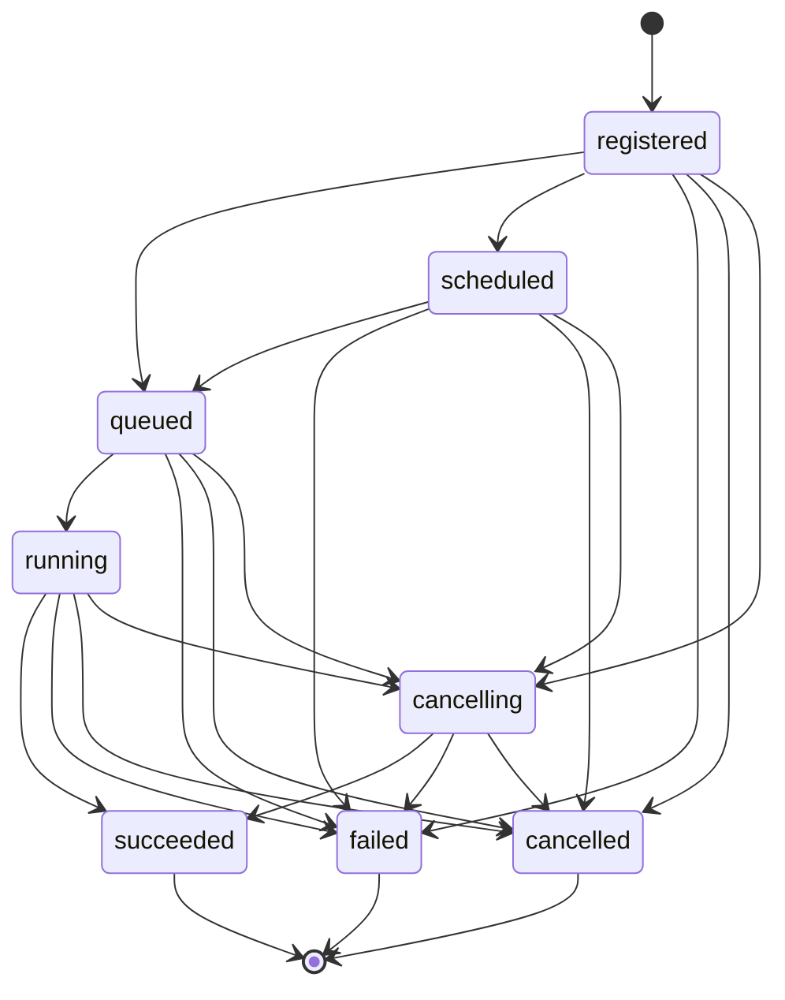

# job

## 概要

この文書は，Geshi における `job` model の仕様を表したものである．

Geshi 側 `job` の状態語彙，状態遷移，実行基盤（BullMQ）側との関係を，ここで規定する．

## 運用

- `job` model の通常の更新は，この文書に対して行う
- `job` model の大きな前提や位置づけを変更する場合は，新しい ADR で扱う
- この文書は概念 model と処理段階を扱うものであり，DB schema や BullMQ 実装そのものは直接規定しない

## 基本方針

- Geshi 側 `job` は，API と履歴参照の基準になる model として扱う
- BullMQ 側 job は，job 実行基盤上の実行単位として扱う
- Geshi 側 `job` と BullMQ 側 job は同一視しない
- Geshi 側 `job` 本体は immutable に近い形で扱う
- `job` 本体には job の定義に属する情報だけを持たせる
- 状態や実行基盤側との対応情報のような変化しうる情報は `job event` 側で扱う
- Geshi 側 `job` の保存と，BullMQ への投入は分離して扱う
- 橋渡し用 job は，重複実行されても不整合を起こしにくいように冪等に扱う

## model

### `job`

Geshi 側 `job` は，少なくとも次のような定義情報を持つ．

- `id`
- `kind`
- `target`
- `payload`
- `createdAt`
- `runAfter`

### `job event`

変化しうる情報は `job event` として積み上げる．

- `jobId`
- `runtimeJobId`
- `occurredAt`
- `status`
- `note`

`runtimeJobId` は実行基盤側で付与される識別子であり，未割当の段階では `null` を取りうる．

`note` は短い補足情報のための欄とし，

- 何をしているか
- どこまで進んだか
- なぜ止まったかの短い要約

を入れる．

一方で，

- スタックトレース
- 詳細な障害情報

は通常のログ側に記録し，`note` には入れない．

## 現在状態

- API で返す現在状態は `job event` の集約で得る
- `job` 本体には current status や progress を持たせない
- 集約結果を view として持つかどうかは実装の問題として，この文書では規定しない

## 状態語彙

Geshi 側 `job` は，少なくとも次の状態を持つ．

- `registered`
- `scheduled`
- `queued`
- `running`
- `cancelling`
- `succeeded`
- `failed`
- `cancelled`

## 状態遷移

Geshi 側 `job` の状態遷移は，少なくとも次に限定する．

- `registered -> queued`
- `registered -> scheduled`
- `registered -> failed`
- `registered -> cancelled`
- `scheduled -> queued`
- `scheduled -> failed`
- `scheduled -> cancelled`
- `queued -> running`
- `queued -> failed`
- `queued -> cancelled`
- `registered -> cancelling`
- `scheduled -> cancelling`
- `queued -> cancelling`
- `running -> cancelling`
- `cancelling -> succeeded`
- `cancelling -> failed`
- `cancelling -> cancelled`
- `running -> succeeded`
- `running -> failed`
- `running -> cancelled`

`succeeded / failed / cancelled` は終端状態とし，終端状態から他状態へは遷移させない．

## 処理段階

### 1. job を登録する

- backend で job を作成したときは，まず Geshi 側 `job` を永続化する
- その後，Geshi 側 `job.id` を引数とする `export job` を enqueue する

### 2. BullMQ への投入可否を判断する

`export job` は，Geshi 側 `job` を読んで次を判断する．

- 即時実行できる job なら，実行用 BullMQ job を enqueue する
- 実行開始条件をまだ満たさない job なら，Geshi 側 `job` を `scheduled` に更新する

### 3. 実行開始条件を満たした job を拾う

- `scheduled` の Geshi 側 `job` を監視する常駐処理を別に持つ
- この `scheduler job` が，worker 数の調整と実行用 BullMQ job の enqueue を行う

### 4. 実行中状態と progress を反映する

- BullMQ 側の実行開始や progress 変化は，`update job` によって Geshi 側 `job` へ反映する
- `queued -> running` は，BullMQ 側の実行開始を受けた `update job` によって確定する

### 5. 実行結果を書き戻す

- 実行用 BullMQ job は，Geshi 側 `job` とは切り離して扱う
- 実行結果は，終端状態専用の `import job` によって Geshi 側 `job` へ反映する

### 6. キャンセルを反映する

- backend が cancel 要求を受けたときは，Geshi 側 `job` を `cancelling` に更新する
- その後，BullMQ 側へ cancel 要求を出す `cancel job` を enqueue する
- `cancel job` は waiting / delayed の job を除去し，active の job には cancellation を要求する
- その結果は `import job` によって Geshi 側 `job` へ反映する
- `cancelling` は，最終的に `cancelled` だけでなく `succeeded` や `failed` に着地しうる

## 備考

- ここで定める状態語彙は Geshi 側 `job` model のものであり，BullMQ 側 state と同一ではない
- `job event` の順序は，まず状態遷移順を優先し，同じ状態内では発生時刻で比較する
- `failed` には，実処理失敗だけでなく，橋渡し処理や投入処理が回復不能に終わった場合も含める
- 同じ橋渡し用 job や event が複数回来ても，Geshi 側 `job` の状態や対応情報を壊さないようにする
- 終端状態への更新は，古い event や重複 event によって巻き戻さないようにする
- progress，親子 job，worker 数調整の具体実装は後続で詰める
