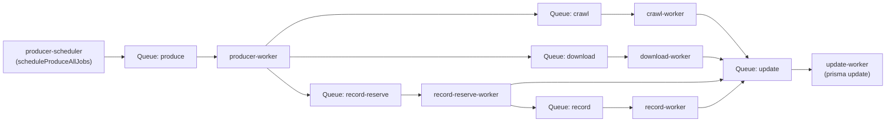

# Crawler Workers

## 基本構成

- 各 worker は producer と updater を例外として model/prisma 側への情報を持たない
  - episodeId とか channelId とかそういうのは worker に渡らない
  - worker からも prisma へのアクセスはしない
- 各 worker で `Result = Either<Error, SuccessValue>` として整理

## Producer

- 各 worker 用の job を生成する
- 5 分毎に起動して全ジョブの生成処理をする
  - prisma から諸々の情報を読んで必要な worker の queue に追加していく
  - TODO: 各 worker ごとに起動タイミングを調整

## Updater

- 各 worker の結果を model/prisma 側へ反映させる
-

## Crawler

- いわゆるクロールのワーカー
  - crawlType に基づいて，targetUrl からエピソードを生成する
- targetUrl : string と crawlType : CrawlType を受け取る
- 成功時は CrawledEpisode の配列と startAt, finishedAt : ISO8601 を updater に渡す
- 失敗時は Error のなにか

## Downloader

- m4a とか mp3 とか static なファイルのダウンロードのワーカー
- targetUrl : string と downloadType : DownloadType を受け取る
- 成功時は downloadPath : string と startAt, finishedAt : ISO8601 を返す
  - downloadPath はあくまでも，ダウンロード時の一時領域として，model側にコピー
- 失敗時は Error のなにか

## RecordReserver

- 録画予約のワーカー
  - 同一時刻に多数の録画ワーカーを起動させるための仕組み
  - producer はこのワーカーへのジョブを遅延実行（予約実行）で登録する
  - このワーカーが Recorder 用のジョブを生成すると同時にワーカーを spawn する
  - recorder 自体も BullMQ の仕組みに乗せることでプロセスやジョブを見失わないようにする
- recorderArgs : RecorderArgs として recorder への引数を受け取る
- 成功時は特になし？

## Recorder

- 録画のワーカー
  - HLS にのみ対応
- targetUrl : string,

## Worker 関係図

- `producer-worker` は `crawl` / `download` / `record-reserve` の各ジョブを作成
- `record-reserve-worker` は `record` ジョブを作成し、`record-worker` 実行を起動
- 各 worker の実行結果は `update` キューに集約され、`update-worker` が model/prisma に反映
